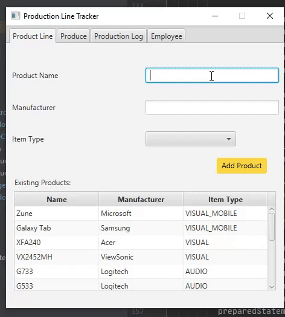

# COP-3003-Production Project
Object Programming Semester Project
I made this project by myself and used my prior personal prior java project experience to make it the best.
I created this project for my Fall 2020 Object programing class. 
The ammunt of experience I had was a bit of personal experience of a personal project 
where I allready worked with sql servers and FXML interfaces. 
This project was created as a assignemnt for my Object Progrmaing class. 
I worked a lot on this project and shows my coding style which should e easy to read.
I made this project In college at Florida Gulf Cost University, for my COP 3003 class.

## Demonstration

## Documentation
https://bheck890.github.io/COP-3003/

## Diagrams

## Getting Started
Admin Password is: B@nAn@& upon first initialization

## Built With
* IntelJ Ultimate  
* FXML Scene Builder 
* H2 SQL Database 

## Contributing
Check out the "FutureAdditionNotes.txt" file in the reposotory for further possible ideas to 
add to the project and add ideas of what to further add to this project.

## Author
Project Coded by - Brandon Heck

## License
This project is licensed under the MIT License.

## Acknowledgments
Project idea - Scott Vanselow

## History
from the Initial idea instructions. I have added additions like User error Messeges,  
and additions to insert information on the added item types.

## Key Programming Concepts Utilized
I have utilized SQL coding Techniques as well as object polymorphism. 
as well as Java FXML setup for further projets.

